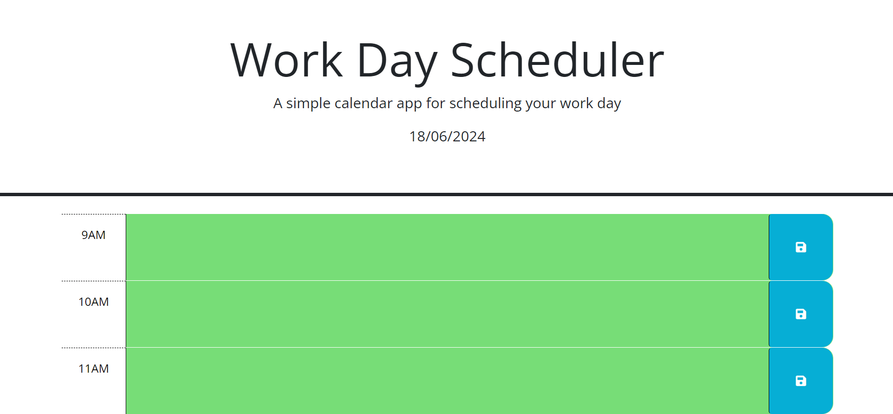
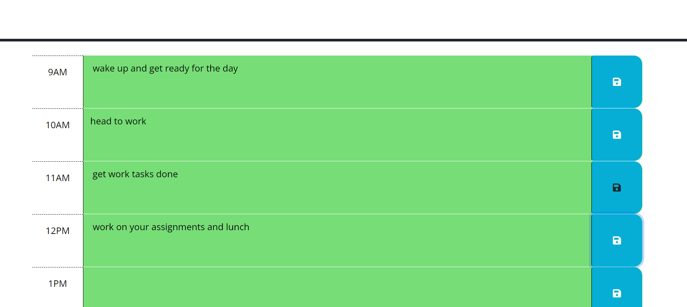

# Work-day-scheduler
Week 5 Challenge to build a work day calendar 

## Description 

The work day scheduler is created to keep track of daily tasks and to keep an individual organised. I was given a starter code to work with that provided some basic html and css, whilst I worked mainly on the javascript and functionality. This project included the use of Third Party APIs such as Day.js and Jquery. 

## User Story

AS AN employee with a busy schedule
I WANT to add important events to a daily planner
SO THAT I can manage my time effectively

## Acceptance Criteria 

GIVEN I am using a daily planner to create a schedule
WHEN I open the planner
THEN the current day is displayed at the top of the calendar
WHEN I scroll down
THEN I am presented with timeblocks for standard business hours of 9am&ndash;5pm
WHEN I view the timeblocks for that day
THEN each timeblock is color coded to indicate whether it is in the past, present, or future
WHEN I click into a timeblock
THEN I can enter an event
WHEN I click the save button for that timeblock
THEN the text for that event is saved in local storage
WHEN I refresh the page
THEN the saved events persist

## How to Use 

1. Clone the repository
2. Open in the web browser 
3. Put your goals in the time blocks provided 
4. Press the save button to save your tasks 
5. Refresh and see your tasks saved 

## Images 

## Links 

